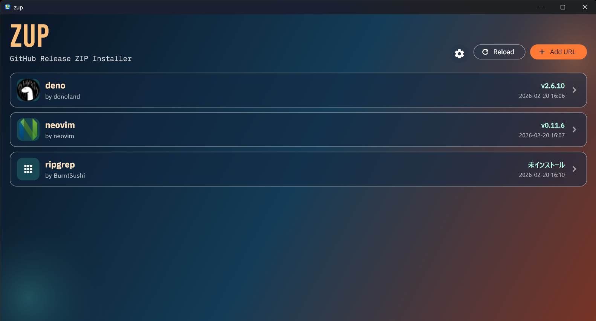
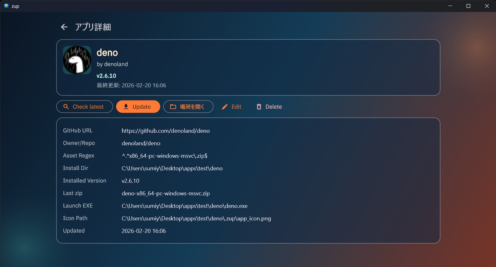

# Zup


[日本語](README.ja.md) | [中文](README.zh.md)

## Product

Zup is a desktop updater for applications distributed as ZIP assets on GitHub Releases.
You register a GitHub repository URL and a ZIP filename regex, then Zup checks the latest release and installs or updates the app into your target directory.

### What It Does

- Tracks app sources by GitHub repository URL.
- Selects release ZIP assets with your regex rule.
- Supports stable-only mode or pre-release-inclusive mode.
- Installs or updates apps and stores installed version metadata.
- Supports optional GitHub Personal Access Token for higher API limits and private repositories.
- Provides UI localization in English, Japanese, and Chinese.

### Screenshots





## Development

### Requirements

- Flutter (beta channel recommended for this project)
- Dart SDK compatible with `sdk: ^3.11.0-200.1.beta`
- Desktop toolchain for your OS (Windows, macOS, or Linux)

### Setup

```bash
flutter pub get
```

### Run

```bash
flutter run -d windows
# or: flutter run -d macos
# or: flutter run -d linux
```

### Test and Format

```bash
flutter test
dart format .
```

### Optional (mise)

If you use `mise`, the project includes tool/task definitions in `mise.toml`:

```bash
mise install
mise run updateDeps
mise run genAppIcons
mise run format
```
